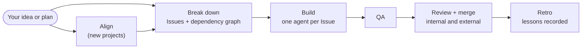

# Showrunner

**Your coding agents write the code. Showrunner runs the room: it plans the work, hands it out, checks every pull request, and merges what passes.**

You describe what you want built. Showrunner splits it into GitHub Issues, gives each Issue to a coding agent in its own worktree, runs QA and code review on every pull request, waits for your external reviewers, merges in dependency order, and writes down what it learned. The lead never edits implementation or test code itself. Its job is to plan, delegate, check the work, and keep you posted.

It runs inside Claude Code as the `/dev` command, with no extra services. Add [Traycer](https://github.com/traycerai/traycer) and the same workflow can send work to Codex, OpenCode, Cursor, and other harnesses.

## Why Showrunner

### Bring a plan and get to work

Already know what you want? In an existing repo, Showrunner skips the product interview and goes straight to a technical breakdown: architecture decisions first, then Issues with testable acceptance criteria and a dependency graph for you to approve. Once you approve, the agents start building.

Starting from scratch? Then Showrunner interviews you one module at a time. Every question comes with a recommended answer and a one-line reason, so most of your replies are "yes" or a small tweak. When a decision is easier to see than to describe, it sends a prototype agent to build a clickable HTML mock or a small backend spike, then asks again with the result in front of you. You say when each module is settled.

> **Coming next:** hand Showrunner a design document for a new project and it pulls the answers out of the document, then asks only about what the document leaves open ([#74](https://github.com/KHAEntertainment/claude-dev-skill/issues/74)).

### Works with the tools you already use

Showrunner plugs into your stack instead of replacing it:

- **[RTK](https://github.com/rtk-ai/rtk)** runs every shell, Git, GitHub, test, and lint command with compact output. It's the one required companion, for a practical reason: a full Issue-to-PR run makes a lot of GitHub calls, and their raw output used to fill the agent's context window until it had to compact again and again. RTK keeps the workflow and shrinks the output.
- **CodeRabbit, Kilo Code, and GitHub Copilot** reviews are detected, waited for on the latest commit, and triaged before merge. They sit alongside Showrunner's own QA and review.
- **[Graft](https://github.com/trailhq/Graft)**, if you use it, gives QA and review a code graph: who calls what, and every place a string appears. Without it, Showrunner traces by hand and records that it did.
- **[Traycer](https://github.com/traycerai/traycer)** adds multi-harness execution (see below).
- **[Linear](https://linear.app)**, if that's where you plan: start a run from a Linear issue, and the agent updates that issue when the work ships. This works through your harness's Linear connection, such as Linear's MCP server.
- **GitHub Issues and pull requests** stay the working record that Showrunner plans, checks, and merges against, whether the work started in Linear or not.

### One lead, many agents, any harness

Out of the box, Showrunner runs entirely in Claude Code and uses Agent Teams for parallel work.

Run it inside Traycer and each worker can use a different harness: Claude Code, Codex, OpenCode, Cursor, and more. You decide which harness, model, subscription, and reasoning effort each role gets, in your project's routing policy or your Traycer agent selection guide. That lets you spread token spend across providers and put each model on the work it does best.

The lead can run from Codex or OpenCode too. When one provider hits its rate limit, you can start a new lead on another harness; it reads the saved run state, checks on the agents already working, and continues without launching duplicates.

We develop against Traycer first and keep the plain Claude Code path fully supported.

### Made for long, hands-off runs

Showrunner already works with the goal modes you have, such as Claude Code's `/goal` or Traycer's `/autobuild`. Hand it a deliverable, and the agents follow Showrunner's workflow and gates while working through the task without checking in after every step. We've built the last few releases this way. Run state is kept in `.agent/dev-state.md`, so a long run survives restarts and lead swaps. Paired with Traycer, a run that takes all afternoon doesn't have to burn through one provider's quota.

> **Coming next:** goal and loop modes built into Showrunner, so you don't have to pair it with a separate plugin. It will stop only for a short, fixed list of reasons; every other decision gets made, recorded, and the run keeps going.

### Every pull request passes the same gates

- Each coding agent gets its own branch, its own worktree, and an explicit list of files it owns.
- QA scores the change, flags scope drift, and audits which code paths the tests cover.
- Review runs in two passes, plus specialist reviewers when the change calls for them.
- A green status check or a bot's "acknowledged" comment doesn't count as a review. If your external reviewer is rate-limited three times in a row, Showrunner brings in a reviewer from a different model family instead of merging unreviewed.
- After each merge, Showrunner verifies the merged commit, re-checks the Issue's acceptance criteria, and reopens the Issue if something didn't ship.
- Run state lives in `.agent/dev-state.md`, so an interrupted run picks up where it stopped.

### Built with itself

We build Showrunner with Showrunner. New versions are planned, built, reviewed, and merged by running it on this repository. When the workflow stumbles, the failure becomes an Issue. A few rules that came out of that:

- CodeRabbit hit its rate limit four times on one pull request ([#46](https://github.com/KHAEntertainment/claude-dev-skill/pull/46)). That became the rate-limit breakpoint: after three in a row, a reviewer from another model family takes the seat ([#48](https://github.com/KHAEntertainment/claude-dev-skill/issues/48)).
- The first greenfield run of v2.1.1 asked nine questions about one module, and the supplied design document already answered six. That became document-first planning ([#74](https://github.com/KHAEntertainment/claude-dev-skill/issues/74), in progress).
- Agents and worktrees piled up, 42 worktrees and 20 GB on one machine, because cleanup only ran at the very end of a run. Per-lane cleanup is tracked in [#73](https://github.com/KHAEntertainment/claude-dev-skill/issues/73).

Every lesson, with the session that produced it, is in [`docs/dogfooding.md`](docs/dogfooding.md).

## How a run works



Showrunner picks a path based on what you ask for, tells you which one and why, and waits for your OK:

| You ask for | Path |
| --- | --- |
| A new project | Align → break down → build → QA → review and merge → retro |
| A feature or large change | Break down → build → QA → review and merge → retro |
| A small fix | Light breakdown → build → review and merge → retro |
| An emergency hotfix | Express breakdown, branched from `main` → build → review and merge → retro |
| A refactor or architecture change | Breakdown with an impact check or refactor rules → build → QA → review and merge → retro |

## Quick start

You need Claude Code, Git, a signed-in GitHub CLI (`gh`), Python 3, and [RTK](https://github.com/rtk-ai/rtk) (`brew install rtk`).

```bash
claude plugin marketplace add KHAEntertainment/claude-dev-skill
claude plugin install dev-skill@khaentertainment-dev-skill
```

Restart Claude Code, then start a run:

```text
/dev-skill:dev add CSV export to the reports page
```

Showrunner only starts when you ask for it. Ordinary coding questions and edits stay ordinary. You can also say during planning that you want the dev workflow once implementation starts, and the agent will invoke it for you after you accept the plan.

To update later, run both commands, then restart Claude Code:

```bash
claude plugin marketplace update khaentertainment-dev-skill
claude plugin update dev-skill
```

Prefer Homebrew, the bare `/dev` command, or Windows? See [Installation](docs/install.md).

## Pick your setup

| Setup | Adds | Good for |
| --- | --- | --- |
| Claude Code only | Nothing beyond the quick start | Most people. Parallel agents use Claude Code's Agent Teams. |
| Claude Code + Traycer | [Traycer](https://github.com/traycerai/traycer) | Workers on Codex, OpenCode, Cursor, and other harnesses; a model per role; long runs spread across providers |
| Codex or OpenCode as the lead | Traycer and the [manual installer](docs/install.md) | Moving the lead to another provider when one is rate-limited |
| Any of the above + Graft | [Graft](https://github.com/trailhq/Graft) | Code-graph evidence in QA and review |
| Any of the above + Linear | Your harness's Linear connection | Starting runs from Linear issues and updating them when the work ships |

Details on each are in [Execution backends](docs/backends.md).

## Roadmap

- **Document-first planning** for new projects that start from a design doc ([#74](https://github.com/KHAEntertainment/claude-dev-skill/issues/74)).
- **A Showrunner planning mode** with a gap pass before breakdown, so a plan from Claude Code's plan mode or Traycer feeds straight into Issues (v2.2.0).
- **Built-in goal and loop modes** for unattended runs, with no separate goal plugin needed: a closed list of hard stops, with everything else decided and recorded ([plan](docs/plans/2026-09-28-goal-mode-and-stop-guard.md)).
- **Optional pre-planning research** through [advise-project-approach](https://github.com/AaravKashyap12/advise-project-approach), if it beats planning without it in A/B runs (v2.2.0).
- **Local CodeRabbit CLI review** as an optional extra lane ([#84](https://github.com/KHAEntertainment/claude-dev-skill/issues/84)).

## Learn more

- [Installation](docs/install.md): every install path, updating, isolated installs, Windows
- [Execution backends](docs/backends.md): Claude-native and Traycer, backend detection, running the lead from Codex or OpenCode
- [Guarantees](docs/guarantees.md): the rules every run follows
- [Architecture decisions](docs/architecture.md) and [dogfooding lessons](docs/dogfooding.md)
- [Changelog](CHANGELOG.custom.md) and [upstream maintenance](UPSTREAM.md)

## Credits

Showrunner is a maintained English fork of [`hnaymyh123-henry/claude-dev-skill`](https://github.com/hnaymyh123-henry/claude-dev-skill), which built the workflow at its core. Thank you to everyone in that lineage, and to:

- **RTK** for the command transport the verification gate is built on, and for keeping long runs inside the context window
- **Traycer** for the multi-harness substrate that lets one lead coordinate many harnesses
- **CodeRabbit** for the external-review seat
- **NanoNets** for [Graft](https://github.com/trailhq/Graft) and its code-graph queries
- **Dietrich Gebert** for [Ponytail](https://github.com/dietrichgebert/ponytail), whose reuse-first ladder shapes how our workers write code
- **ayghri** for [i-have-adhd](https://github.com/ayghri/i-have-adhd), whose brevity rules our end-of-turn replies are written to fit

## License

MIT. See [LICENSE](LICENSE).
